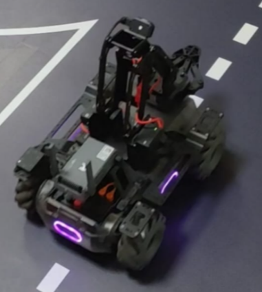
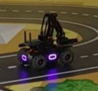

# MobileRobot-Openloopcontrol
## Aim:

To develop a python control code to move the mobilerobot along the predefined path.

## Equipments Required:
1. RoboMaster EP core
2. Python 3.7

## Procedure

### Step1:
Initiate the MobileRobot.
<br/>

### Step2:
Connect your PC with the MobileRobot.
<br/>

### Step3:
Open Python program.
<br/>

### Step4:
Program the movements of the robot using python code.
<br/>

### Step5:
Execute the python program.
<br/>

## Program
```python
'''
Python control code to move the mobilerobot along the predefined path.
Developed by: Vishranthi A
Register No.: 212221230124
'''
from robomaster import robot
import time

if __name__ == '__main__':
    ep_robot = robot.Robot()
    ep_robot.initialize(conn_type="ap")

    ep_chassis = ep_robot.chassis

    ep_chassis.move(x=2, y=0, z=0, xy_speed=0.75).wait_for_completed()

    ep_chassis.move(x=0, y=0, z=90, xy_speed=1).wait_for_completed()

    ep_chassis.move(x=2, y=0, z=0, xy_speed=0.75).wait_for_completed()

    ep_robot.close()
```

## MobileRobot Movement Image:


## start point:


## end point:


## MobileRobot Movement Video:
video: https://youtube.com/shorts/huw0M7a6Exg?feature=share

## Result:
Thus the python program code is developed to move the mobilerobot in the predefined path.

```
Mobile Robotics Laboratory
Department of Artificial Intelligence and Data Science/ Machine Learning
Saveetha Engineering College
```
